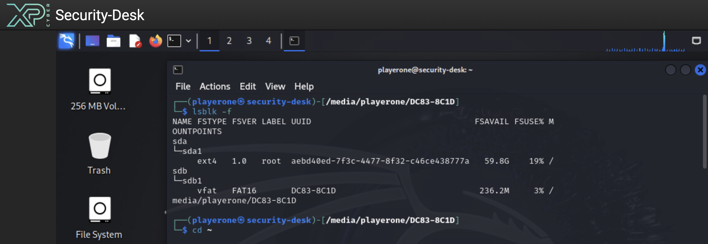
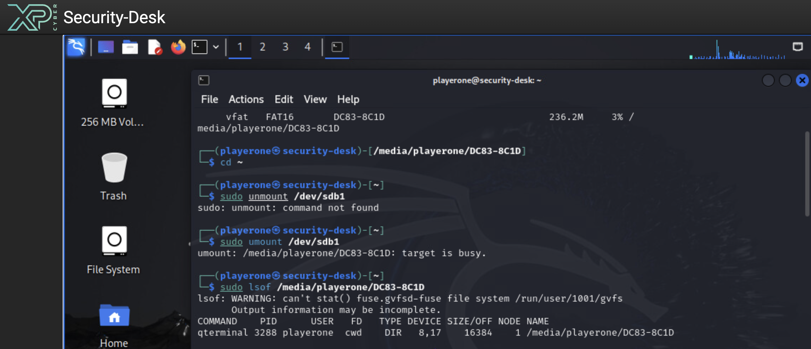
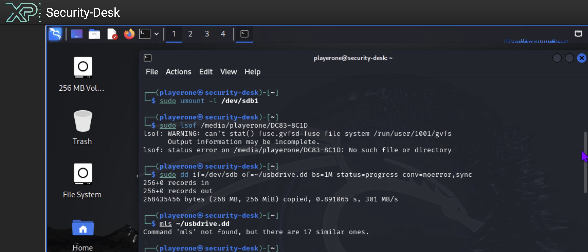
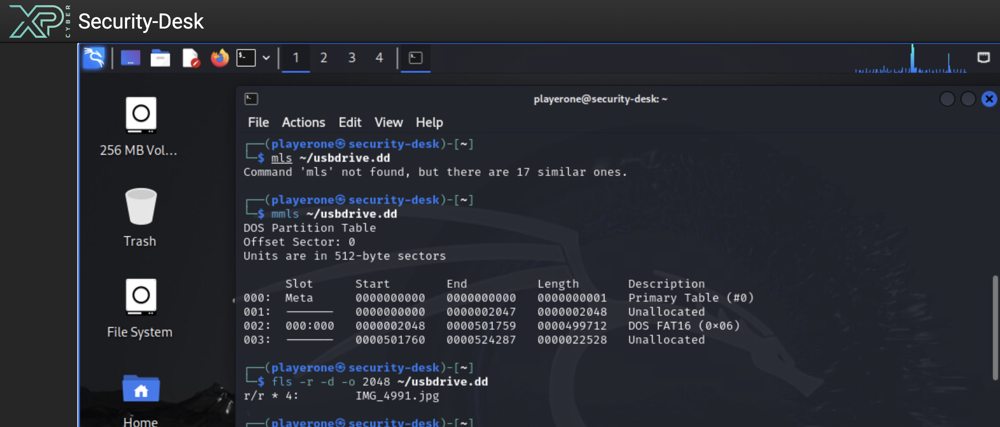
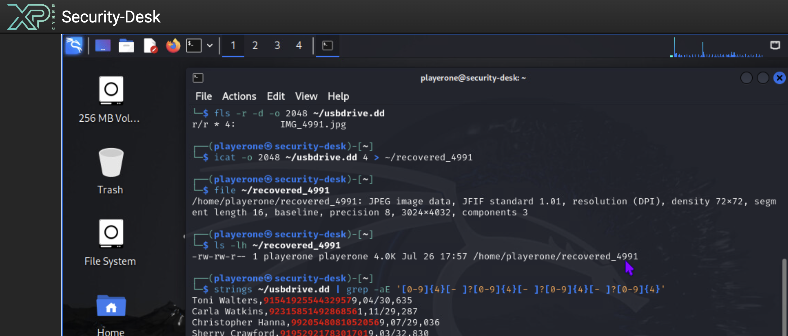

# NICE Challenge - Credit Card Concealment

A walkthrough for the **Credit Card Concealment** challenge by *Oscar Luna*, run through the [NICE Challenge Project](https://nice-challenge.com/).

- **DCWF Work Role:** Cyber Defense Forensics Analyst - task 1082 (*Perform file system forensic analysis*)
- **NICE Framework:** Protection and Defense / Digital Forensics - T0179 (*Perform static media analysis*)

> ⚠️ All card numbers, names, expirations, and CVVs referenced in this walkthrough are **synthetic test data generated inside the NICE Challenge lab environment**. No real cardholder information is shown, and card data recovered from the drive is redacted in this write-up.

---

## Scenario

An intern named "Rob" was caught leaving the company premises with a USB drive - a violation of company policy. The initial mounted view of the drive shows only four JPEGs of a cat, which is the story Rob gave: *"I wanted to have some pictures of my cat with me at work."* Management wants a deeper look at the drive to confirm whether any data is being concealed.

Player role: forensics analyst on `Security-Desk` (a Kali workstation) with the USB drive attached.

---

## TL;DR

Rob deleted a plaintext CSV of stolen credit-card data (`Name,PAN,MM/YY,CVV`) from the FAT16 partition and then dropped four cat photos on top to make the drive look innocent. FAT16 clears the directory entry and file-allocation-table cluster chain on deletion, but leaves the underlying data on disk. The write-up walks the standard **Sleuth Kit** recovery path (`dd → mmls → fls -d → icat`) and then bypasses the filesystem entirely with `strings | grep` to pull the concealed CSV out of unallocated space.

---

## Tools used

| Tool | Purpose |
|---|---|
| `lsblk` | Identify the USB block device |
| `umount` | Detach the mounted filesystem prior to imaging |
| `lsof` | Find the process holding the mount open |
| `dd` | Bit-for-bit forensic image of the raw device |
| The Sleuth Kit - `mmls` | Enumerate the partition table |
| The Sleuth Kit - `fls` | List filesystem entries, including deleted ones |
| The Sleuth Kit - `icat` | Recover file content by inode |
| `file` | Identify recovered file type |
| `strings` | Extract printable ASCII from the raw disk image |
| `grep` | Regex search for cardholder-data patterns |

---

## Step 1 - Identify the USB device

Both the VM's own disk and the USB stick are attached to the system. Enumerate them and pick out which one is the USB:

```bash
lsblk -f
```



**Result:** `sda` = the VM's own root disk (do not touch). `sdb` = the USB stick with a single FAT16 partition `sdb1`, volume label `DC83-8C1D`, currently automounted at `/media/playerone/DC83-8C1D`. Every subsequent step targets `/dev/sdb`.

---

## Step 2 - Unmount before imaging

Never image a mounted filesystem. First attempt:

```bash
sudo umount /dev/sdb1
```

Fails with `target is busy` because a file-manager process is still holding a working directory inside the mount. Pinpoint the culprit:

```bash
sudo lsof /media/playerone/DC83-8C1D
```

Shows `qterminal PID 3288` with its `cwd` inside the mount.



Do a **lazy unmount** to detach immediately and clean up references as they close - safe for read-only imaging:

```bash
sudo umount -l /dev/sdb1
```

---

## Step 3 - Forensically image the whole device

```bash
sudo dd if=/dev/sdb of=~/usbdrive.dd bs=1M status=progress conv=noerror,sync
```

| Flag | Meaning |
|---|---|
| `if=/dev/sdb` | Input = the parent block device (captures MBR + all partitions + trailing unallocated space) |
| `of=~/usbdrive.dd` | Output = image file in `$HOME` |
| `bs=1M` | 1 MiB block size (fast) |
| `status=progress` | Print live throughput |
| `conv=noerror,sync` | On bad sector: pad with zeros and continue - standard forensic setting |



`256+0 records in / 256+0 records out - 268,435,456 bytes (256 MiB) copied`. All analysis from here on runs against `~/usbdrive.dd`, never against the live device.

---

## Step 4 - Parse the partition table

```bash
mmls ~/usbdrive.dd
```

```
DOS Partition Table
Offset Sector: 0
Units are in 512-byte sectors

     Slot      Start        End          Length       Description
000: Meta      0000000000   0000000000   0000000001   Primary Table (#0)
001: -------   0000000000   0000002047   0000002048   Unallocated
002: 000:000   0000002048   0000501759   0000499712   DOS FAT16 (0x06)
003: -------   0000501760   0000524287   0000022528   Unallocated
```

Reading the table:

- **Slot 000** - the Master Boot Record (sector 0).
- **Slot 001** - 1 MiB alignment pad (sectors 0-2047). Normal for any modern-partitioned drive.
- **Slot 002** - the actual **FAT16 partition, starting at sector 2048.** That `2048` is the number every subsequent TSK command needs as `-o 2048`.
- **Slot 003** - **~11 MB of unallocated space at the end of the disk** (sectors 501760-524287). The filesystem doesn't manage this region, which makes it a common hiding spot.

---

## Step 5 - List deleted filesystem entries

```bash
fls -r -d -o 2048 ~/usbdrive.dd
```

| Flag | Meaning |
|---|---|
| `-r` | Recurse into subdirectories |
| `-d` | Show **only deleted** entries |
| `-o 2048` | Filesystem begins at sector 2048 (from `mmls`) |

Output:

```
r/r * 4:    IMG_4991.jpg
```



How to read the line: `r/r` = regular file; `*` = **deleted**; `4` = inode number; `IMG_4991.jpg` = the filename that used to be there. Someone had a file named `IMG_4991.jpg`, deleted it, and dropped a new `IMG_4991.jpg` (the cat photo currently visible) in its place - classic misdirection using the same filename.

---

## Step 6 - Recover the deleted file by inode

```bash
icat -o 2048 ~/usbdrive.dd 4 > ~/recovered_4991
file ~/recovered_4991
ls -lh ~/recovered_4991
```

Only **4 KB** comes back - even though `file` identifies it as a `3024×4032 JPEG`, which should be a couple of megabytes.

**Why only 4 KB?** FAT stores files as a **linked chain of clusters**. On deletion, FAT clears the directory entry AND zeros the chain of "next cluster" pointers. `icat` can therefore only follow the *starting* cluster (recorded in the directory entry) before hitting a dead end. One cluster on this drive = 4 KB.

**But the data is not gone.** The subsequent clusters were never overwritten - they're still physically on disk, just no longer reachable *through the filesystem*. That distinction is the single most important idea in file-system forensics.

---

## Step 7 - Bypass the filesystem, scan the raw image

Since the concealed content is sitting in unallocated clusters, read the disk image as raw bytes and look for anything that matches a credit-card shape:

```bash
strings ~/usbdrive.dd | grep -aE '[0-9]{4}[- ]?[0-9]{4}[- ]?[0-9]{4}[- ]?[0-9]{4}'
```

- `strings` - walk the 256 MB image byte by byte and print any run of ≥4 printable ASCII characters.
- `grep -aE` - treat input as text (`-a`), extended regex (`-E`).
- Regex `[0-9]{4}[- ]?[0-9]{4}[- ]?[0-9]{4}[- ]?[0-9]{4}` - four digits, optional space/dash, ×4. That's the shape of a 16-digit PAN with or without common separators.



**Result:** a full CSV of records in the format `FirstName LastName,CardNumber(16),ExpiryMM/YY,CVV(3)`, recovered from unallocated space where the deleted file's data still lived. Sample (redacted):

```
Toni Walters,9154********2957,04/30,***
Carla Watkins,9231********8561,11/29,***
Penny Harris,1331********8703,08/32,***
...
```

Save the filtered list as evidence:

```bash
strings ~/usbdrive.dd \
  | grep -aE '^[A-Z][a-z]+ [A-Z][a-z]+,[0-9]{16},[0-9]{2}/[0-9]{2},[0-9]{3,4}$' \
  > ~/stolen_cards.csv
wc -l ~/stolen_cards.csv
```

To verify a specific record before submitting to the challenge webform:

```bash
strings ~/usbdrive.dd | grep -a "Penny Harris"
```

---

## Findings

- The USB drive contained a **deleted plaintext CSV of cardholder data** (name, PAN, expiration, CVV) recoverable from unallocated space on the FAT16 partition.
- The four visible JPEG "cat photos" were a cover story. The sensitive file was deleted before the drive was carried off premises so a casual mounted-view inspection would show only the benign photographs.
- The concealment technique relied on the well-known FAT property that **deleting a file only clears the directory entry and cluster chain - the file's data remains on disk until overwritten.**
- Approximately 11 MB of unallocated space also exists at the tail of the disk (slot 003 in `mmls`) and was covered by the raw-image `strings | grep` sweep.

## Recommendations

- Preserve the acquired image (`~/usbdrive.dd`) and the recovered CSV as evidence; compute and record SHA-256 hashes for chain of custody.
- Escalate to HR and Legal - the recovered records constitute evidence of intentional data exfiltration, not incidental policy violation.
- Enforce the group-policy control to disable USB mass-storage devices. This incident is a concrete justification for closing that control gap.
- Notify affected cardholders and the appropriate payment brands / regulators per the organization's incident-response and PCI-DSS obligations.

---

## Key takeaway

> **The filesystem forgetting where a file lives is not the same as the file being gone.** File-system forensics is the practice of separating those two ideas: use filesystem tools (`fls`, `icat`) to find *what used to exist*, and raw-image tools (`strings`, `grep`, `photorec`) to recover *the data itself* from unallocated space when the filesystem's pointers are broken.

---

## License

MIT - see [LICENSE](LICENSE).
