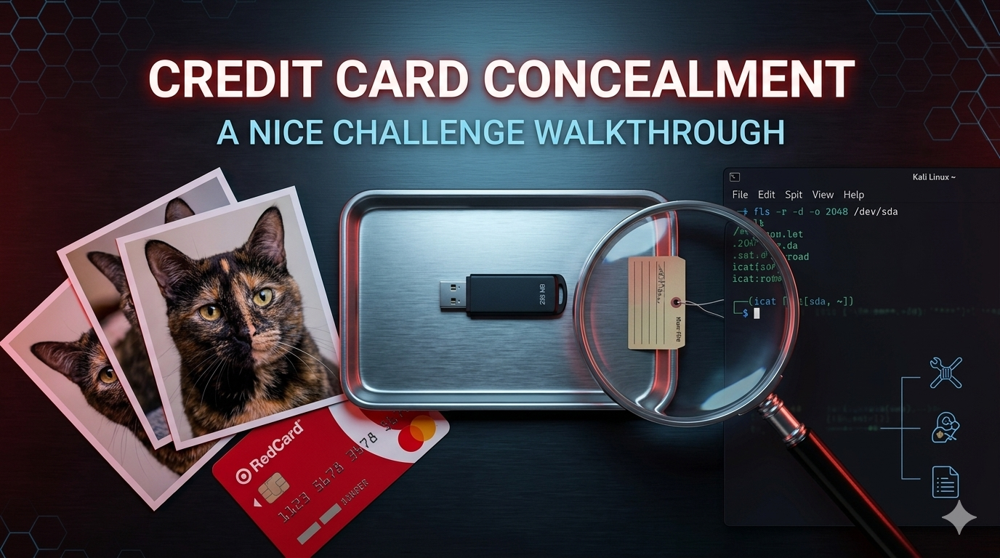
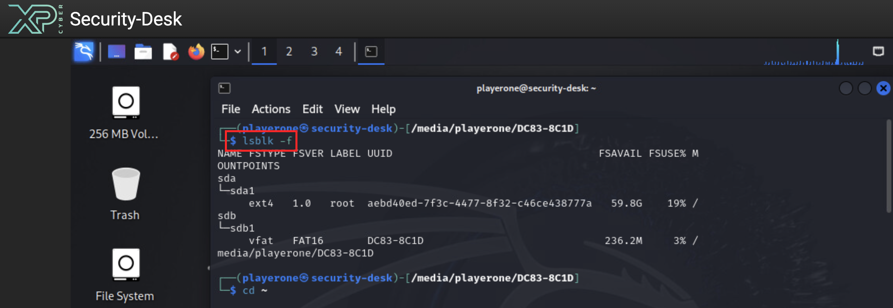
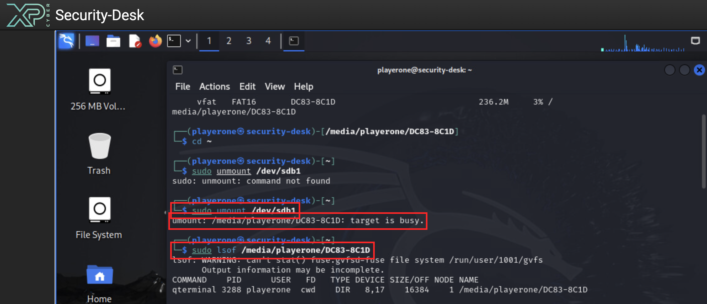
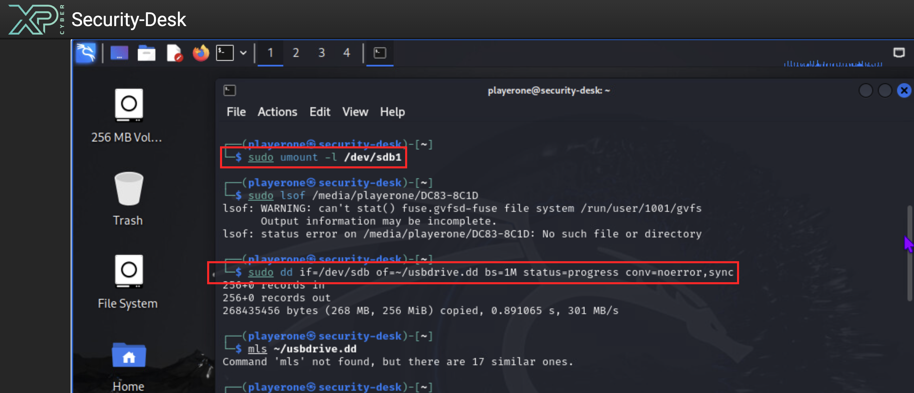
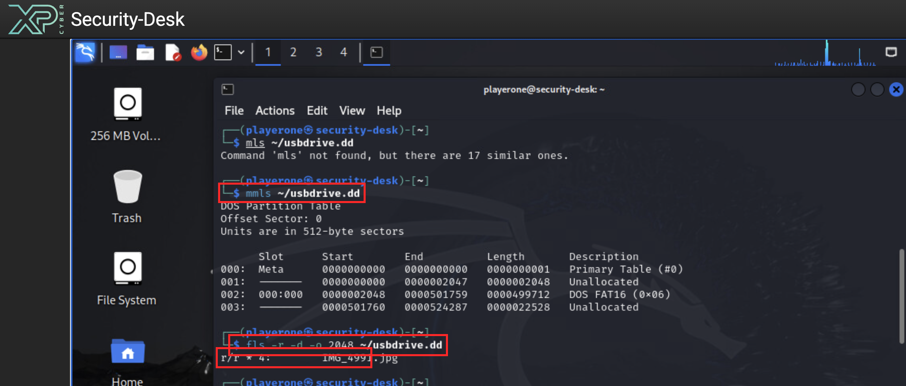
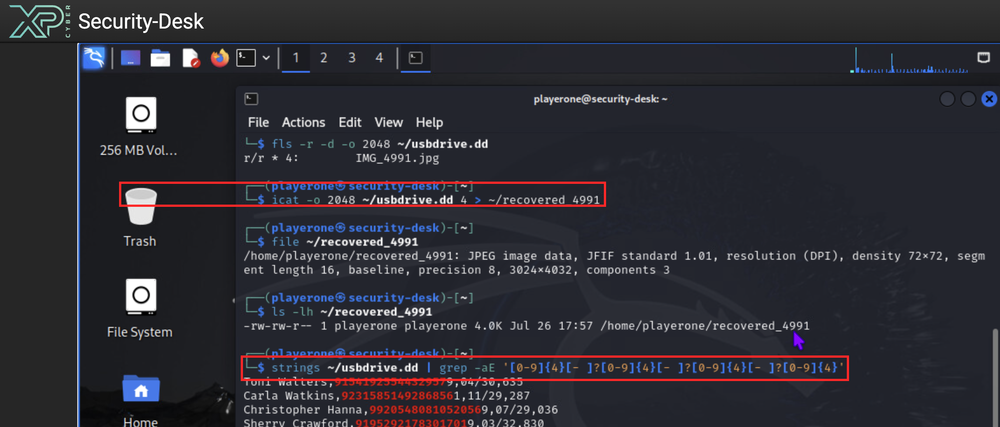

# NICE Challenge - Credit Card Concealment - Walkthrough and Writeup (The Sleuth Kit / FAT16 Forensics)



A walkthrough for the **Credit Card Concealment** challenge by *Oscar Luna*, run through the [NICE Challenge Project](https://nice-challenge.com/).

- **DCWF Work Role:** Cyber Defense Forensics Analyst - task 1082 (*Perform file system forensic analysis*)
- **NICE Framework:** Protection and Defense / Digital Forensics - T0179 (*Perform static media analysis*)

---

> ### ⚠️ Preserve evidence integrity before you touch the drive
>
> Digital-forensics rule number one: never modify the original evidence. Anything you write to the drive changes access timestamps, allocation tables, and (worst case) overwrites unallocated clusters that hold the data you are trying to recover.
>
> **If you have already opened, edited, saved, or copied any file on the USB during triage, stop.** Power the workstation off, power it back on, and re-attach the drive **read-only** (ideally through a hardware write blocker) before you continue. Then image the device with `dd` first and do all analysis against the image, never the live device. Everything below assumes the drive is still in its original state.
>
> Immediately after the `dd` in Step 3 finishes, record the image's SHA-256 hash and keep it with the case notes. If anyone later questions whether the evidence was altered, the hash is your proof.

---

> ### ⚠️ Data-handling notice
>
> All card numbers, names, expirations, and CVVs referenced in this walkthrough are **synthetic test data generated inside the NICE Challenge lab environment**. No real cardholder information is shown, and card data recovered from the drive is redacted in this write-up.

---

## Scenario

An intern named "Rob" was caught leaving the company premises with a USB drive, which is against company policy. The initial mounted view of the drive shows only four JPEGs of a cat. Rob's story is that he *"wanted to have some pictures of my cat with me at work"*. Management wants a deeper look to confirm whether any data is being concealed.

Player role: forensics analyst at the `Security-Desk` workstation (a Kali VM) with the seized USB drive attached.

---

## TL;DR

Rob deleted a plaintext CSV of stolen credit-card data (`Name,PAN,MM/YY,CVV`) from the FAT16 partition, then dropped four cat photos on top to make the drive look innocent. FAT16 clears the directory entry and file-allocation-table cluster chain on deletion, but leaves the underlying data on disk. This write-up walks the standard **Sleuth Kit** recovery path (`dd -> mmls -> fls -d -> icat`) and then bypasses the filesystem entirely with `strings | grep` to pull the concealed CSV out of unallocated space.

---

## Tools used

| Tool | Purpose |
|---|---|
| `lsblk` | Enumerate block devices to identify which one is the USB |
| `umount` | Detach the mounted filesystem prior to imaging |
| `lsof` | Find the process holding a mount open when `umount` refuses to detach |
| `dd` | Bit-for-bit forensic image of the raw device |
| `sha256sum` | Hash the acquired image for chain-of-custody |
| The Sleuth Kit - `mmls` | Enumerate the partition table of the disk image |
| The Sleuth Kit - `fls` | List filesystem entries, including deleted ones |
| The Sleuth Kit - `icat` | Recover file content by inode number |
| `file` | Identify the type of a recovered blob |
| `ls -lh` | Sanity-check size of a recovery |
| `strings` | Extract printable ASCII strings from the raw disk image |
| `grep` | Regex-search for cardholder-data patterns |

---

## Step 1 - Identify the USB block device

**Goal of this step.** Confirm which `/dev/sdX` path corresponds to the seized USB drive, so every subsequent command (unmount, image, analyze) targets the correct device and not the VM's own root disk. Getting this wrong means either (a) imaging the wrong disk and wasting time, or (b) accidentally overwriting the wrong disk with a typo like `if=` swapped with `of=` in `dd` - a career-ending mistake in real DFIR.

**Command:**

```bash
lsblk -f
```

**What each part does:**

| Piece | Meaning |
|---|---|
| `lsblk` | *List block devices.* Prints a tree of every block device the Linux kernel knows about (physical disks, partitions, LVM volumes, loop devices, etc.). No arguments needed to run. |
| `-f` | *Show filesystem info.* Adds four columns per row: filesystem type (`FSTYPE`), filesystem version (`FSVER`), label (`LABEL`), and UUID. Without `-f` you only get device names and sizes. Filesystem type is what tells us "this is the FAT16 USB". |

There are several other ways to enumerate disks on Linux (`fdisk -l`, `blkid`, `parted -l`, `/proc/partitions`), but `lsblk -f` is the friendliest because it puts device tree, filesystem type, label, and mount point all in one view.

**Screenshot:**



**Reading the output:**

```
NAME    FSTYPE  FSVER  LABEL     UUID                                  FSAVAIL  FSUSE%  MOUNTPOINTS
sda
└─sda1  ext4    1.0    root      aebd40ed-7f3c-4477-8f32-c46ce438777a  59.8G    19%     /
sdb
└─sdb1  vfat    FAT16  DC83-8C1D                                       236.2M   3%      /media/playerone/DC83-8C1D
```

- **`sda`** is the VM's own virtual hard disk. `sda1` is formatted `ext4` and mounted at `/` (the root of the running Kali system). **Do not touch this device.** If you `dd` it by mistake you will corrupt the running system.
- **`sdb`** is the USB stick. `sdb1` is the single partition on it, formatted `vfat` (which on Linux covers FAT12/FAT16/FAT32) at version `FAT16`, volume label `DC83-8C1D`, and it is currently auto-mounted by the desktop environment at `/media/playerone/DC83-8C1D`.

**Two useful facts we now know:**

1. Every subsequent command targets either **`/dev/sdb`** (the whole drive, parent) or **`/dev/sdb1`** (just the partition). We will image the parent to capture the MBR + partition + any unallocated tail.
2. The filesystem is **FAT16.** That matters because FAT deletion semantics (directory-entry flag + zeroed cluster chain) are the exact behaviour we will exploit later to recover Rob's file.

---

## Step 2 - Unmount the filesystem before imaging

**Goal of this step.** Detach the FAT16 filesystem cleanly so nothing writes to it while we take the forensic image. Imaging a mounted, actively-updated filesystem produces a smeared snapshot: FAT structures, timestamps, and cached writes can change mid-copy and leave the image internally inconsistent.

**First attempt:**

```bash
sudo umount /dev/sdb1
```

| Piece | Meaning |
|---|---|
| `sudo` | Run as root. Unmounting a filesystem you did not mount yourself requires root privileges. |
| `umount` | *Unmount.* Removes the filesystem from the directory tree. Note the spelling: `umount` (one `n`). A common typo is `unmount`, which will just say "command not found". |
| `/dev/sdb1` | Target: unmount whatever filesystem lives on this partition. You could equivalently pass the mount point (`/media/playerone/DC83-8C1D`); both work. |

**What we got:**

```
umount: /media/playerone/DC83-8C1D: target is busy.
```

Something has an open handle inside the mount, so the kernel refuses. Find out who:

```bash
sudo lsof /media/playerone/DC83-8C1D
```

| Piece | Meaning |
|---|---|
| `lsof` | *List open files.* Prints every file descriptor currently held by any process on the system. |
| `/media/playerone/DC83-8C1D` | Filter: show only handles whose path lives inside this directory. Without the filter, `lsof` prints thousands of lines. |

**Screenshot:**



The offender is `qterminal PID 3288` with its **cwd** (current working directory) sitting inside the mount. A terminal window was left with its shell `cd`'d into the USB folder, so the kernel treats the mount as in-use.

**Fix - lazy unmount:**

```bash
sudo umount -l /dev/sdb1
```

| Piece | Meaning |
|---|---|
| `-l` | *Lazy unmount.* Immediately detaches the filesystem from the directory tree, then cleans up remaining references as they close naturally. Safe here because we only care about **read** consistency for imaging: from this moment on, nothing new can write into the mount, even if a lingering process still has a stale handle. |

After this, verify it is really gone:

```bash
mount | grep sdb
```

Silent output = the USB is no longer mounted anywhere. Now safe to image.

---

## Step 3 - Forensically image the whole device with `dd`

**Goal of this step.** Produce a bit-for-bit copy of the raw device into a regular file on disk, then work only against that file for the rest of the investigation. This preserves the original evidence (nothing else touches `/dev/sdb` after this) and gives us a reproducible artefact we can hash, archive, and share.

**Command:**

```bash
sudo dd if=/dev/sdb of=~/usbdrive.dd bs=1M status=progress conv=noerror,sync
```

| Piece | Meaning |
|---|---|
| `sudo` | Root, because reading `/dev/sdb` directly requires it. |
| `dd` | The classic Unix block-copy utility. Reads from `if` (input file), writes to `of` (output file), one block at a time. |
| `if=/dev/sdb` | *Input file.* Notice we use the **parent device**, not the partition (`sdb`, not `sdb1`). This captures the MBR at sector 0, the alignment pad, the FAT16 partition, **and** the ~11 MB of unallocated space at the end of the disk. If you only image `sdb1` you miss the partition table and the trailing unallocated region, both of which can hide data. |
| `of=~/usbdrive.dd` | *Output file.* A regular file in the analyst's home folder. The `.dd` extension is a convention meaning "raw disk image". |
| `bs=1M` | *Block size = 1 MiB.* `dd` reads and writes one block at a time; a larger block size means fewer syscalls, which is much faster. The default of 512 bytes would take dramatically longer on a 256 MB drive and hours on a large one. |
| `status=progress` | Print live throughput (`X bytes copied, Y s, Z MB/s`) so you can watch it. Not required for correctness, but very useful on multi-GB drives. |
| `conv=noerror,sync` | Behaviour on read errors: `noerror` = do not abort if a sector is unreadable; `sync` = pad the failed read with NUL bytes so alignment is preserved. This pair is the standard forensic setting: never lose alignment, never give up on a bad drive. |

**Screenshot:**



**Result:**

```
256+0 records in
256+0 records out
268435456 bytes (268 MB, 256 MiB) copied, 0.891065 s, 301 MB/s
```

256 blocks of 1 MiB each = 256 MiB written, matching the drive's capacity.

**Immediately hash the image for chain-of-custody:**

```bash
sha256sum ~/usbdrive.dd | tee ~/usbdrive.dd.sha256
```

| Piece | Meaning |
|---|---|
| `sha256sum` | Produce a SHA-256 hash of the file. |
| `| tee <file>` | Send the output both to the terminal (so you can see it) and to a file (so it is captured). |

Anyone later can re-hash the image and compare against `usbdrive.dd.sha256`. If the hash matches, the image is provably identical to what you acquired at this moment.

From here on, **every command runs against `~/usbdrive.dd`**, not `/dev/sdb`. The physical drive can be sealed and stored.

---

## Step 4 - Parse the partition table with `mmls`

**Goal of this step.** Learn the layout of the disk image: where partitions start and end, and whether any regions are unallocated. This gives us the sector offsets that every later Sleuth Kit command needs, and highlights any suspicious gaps where data could be hiding outside the filesystem.

**Command:**

```bash
mmls ~/usbdrive.dd
```

| Piece | Meaning |
|---|---|
| `mmls` | *Media Management List* - a Sleuth Kit tool that reads the partition table (MBR/GPT/BSD/etc.) at the start of a disk image and prints every region it finds. |
| `~/usbdrive.dd` | The disk image to inspect. |

`mmls` takes no other required flags here because the image is a standard MBR-partitioned raw image, which is auto-detected.

**Screenshot:**



**Output:**

```
DOS Partition Table
Offset Sector: 0
Units are in 512-byte sectors

     Slot      Start        End          Length       Description
000: Meta      0000000000   0000000000   0000000001   Primary Table (#0)
001: -------   0000000000   0000002047   0000002048   Unallocated
002: 000:000   0000002048   0000501759   0000499712   DOS FAT16 (0x06)
003: -------   0000501760   0000524287   0000022528   Unallocated
```

The header tells us the unit of measurement: **512-byte sectors.** So sector 2048 = byte offset `2048 * 512` = 1,048,576 = 1 MiB into the disk.

Reading each row:

- **Slot 000 - Meta.** Sector 0. The Master Boot Record itself. It is not user data; it is the tiny 512-byte table that describes where the partitions live. `mmls` read this sector to produce the rest of the output.
- **Slot 001 - Unallocated pad.** Sectors 0-2047 (1 MiB). This is the standard modern **partition-alignment pad**: keeping the first partition on a 1 MiB boundary vastly improves performance on modern drives and SSDs. Almost every drive formatted in the last 15 years has this gap, and it is almost always zeros. Worth a quick check but rarely interesting.
- **Slot 002 - The FAT16 partition.** Sectors 2048-501759 (~244 MB). This is the actual filesystem visible in Thunar. **The number `2048` is critical:** it is the offset we will feed to every subsequent Sleuth Kit command as `-o 2048`, telling them "the filesystem you are analyzing begins at this sector of the image."
- **Slot 003 - Trailing unallocated.** Sectors 501760-524287 (~11 MB). The drive is 256 MB but the FAT16 partition only claims 244 MB, leaving an ~11 MB "tail" that the filesystem does not manage. **This is a classic hiding spot** - nothing at the OS or file-manager level ever looks here. Our final `strings | grep` sweep in Step 7 scans the entire image, so this region is covered automatically.

Visual of the layout:

```
Sector: 0          1          2048                        501760   524288
        v          v          v                           v        v
        +-+--------+---------------------------------------+--------+
        |M| pad    |       FAT16 partition (~244 MB)       |  ~11MB |
        |B| (~1MB) |      (4 cat JPGs + deleted CSV)       |  tail  |
        |R|        |                                       |        |
        +-+--------+---------------------------------------+--------+
```

---

## Step 5 - List deleted files with `fls`

**Goal of this step.** Ask the filesystem: "What files have ever existed here that are now deleted?" On FAT this is straightforward because deletion is a soft operation - the directory entry sticks around, just marked as deleted.

**Command:**

```bash
fls -r -d -o 2048 ~/usbdrive.dd
```

| Piece | Meaning |
|---|---|
| `fls` | *File List* - the Sleuth Kit's directory walker. Reads the filesystem's directory entries and prints them. |
| `-r` | *Recursive.* Descend into subdirectories. Without `-r`, `fls` only lists the top-level directory. |
| `-d` | *Deleted entries only.* Restrict output to entries the filesystem has marked as deleted (a `*` will appear beside them). Extremely useful for cutting through the noise of a large filesystem. Combine with `-u` if you want undeleted (live) entries too. |
| `-o 2048` | *Offset in sectors.* Tells The Sleuth Kit "the filesystem begins at sector 2048 of the image" - the value we got from `mmls`. Without this, `fls` would try to interpret the image starting at sector 0 (the MBR) and fail. |
| `~/usbdrive.dd` | The image to walk. |

**Output:**

```
r/r * 4:    IMG_4991.jpg
```

**How to read this line:**

- **`r/r`** - two file-type codes separated by a slash. The first is the type according to the *directory entry*; the second is the type according to the *metadata entry* (inode). Both say `r` = regular file. If they disagreed, that would itself be suspicious (indicative of tampering).
- **`*`** - **DELETED.** The single most important character in the line. It means this entry exists in the directory but is flagged as removed.
- **`4`** - the *inode number* (on FAT, this is really the sequence number of the directory-entry slot, but The Sleuth Kit abstracts it to look like an inode). This is the handle we will pass to `icat` next.
- **`IMG_4991.jpg`** - the filename recorded in the directory entry.

**What this tells us about Rob's behaviour.** There is a currently-visible file *also* named `IMG_4991.jpg` in the mounted view of the drive. So Rob had a file named `IMG_4991.jpg`, deleted it, then created a new file with the exact same name (the cat photo we currently see). This is textbook filename-collision misdirection: to any casual observer, the file list looks unchanged, but a deleted entry with the same name lingers underneath and can be recovered.

---

## Step 6 - Recover the deleted file's contents with `icat`

**Goal of this step.** Extract whatever bytes are still reachable for inode 4, so we can inspect the original `IMG_4991.jpg` that Rob deleted.

**Commands:**

```bash
icat -o 2048 ~/usbdrive.dd 4 > ~/recovered_4991
file ~/recovered_4991
ls -lh ~/recovered_4991
```

| Piece | Meaning |
|---|---|
| `icat` | *Inode cat* - the Sleuth Kit equivalent of `cat`, but the file is addressed by **inode number** instead of by path. Useful when there is no live filename to `cat` (because the file is deleted). |
| `-o 2048` | Same partition offset as before. |
| `~/usbdrive.dd` | The image. |
| `4` | The inode number to extract, from `fls` output. |
| `> ~/recovered_4991` | Shell **output redirection.** By default `icat` prints file bytes to standard output; redirecting into a file lets us save the recovery for later inspection with `file`, `xxd`, or an image viewer. |
| `file <path>` | Identify what kind of file something is by looking at its magic bytes. Independent of the extension. |
| `ls -lh <path>` | List with long format (`-l`) and human-readable sizes (`-h`) so we see the file size in KB/MB rather than raw bytes. |

**Result:**

```
/home/playerone/recovered_4991: JPEG image data, JFIF standard 1.01, resolution (DPI), density 72x72, segment length 16, baseline, precision 8, 3024x4032, components 3
-rw-rw-r-- 1 playerone playerone 4.0K Jul 26 17:57 /home/playerone/recovered_4991
```

`file` says this is a 3024x4032 JPEG (which should be a couple of megabytes), but `ls -lh` reports only **4.0 KB**. Why the mismatch?

**Explanation - FAT deletion semantics.** FAT stores files as a **linked chain of clusters.** Each cluster's entry in the File Allocation Table records the *next* cluster in the file; only the *first* cluster is remembered in the directory entry. When FAT deletes a file, it does two things:

1. Marks the directory entry as deleted (the first byte of the filename is overwritten with `0xE5`).
2. **Zeroes out the cluster chain** in the FAT: every "next cluster" pointer is wiped.

So `icat` can find and read the *starting* cluster (from the still-intact directory entry), but the moment it tries to follow the chain to cluster #2, the pointer is 0. Dead end. On this drive one cluster = 4 KB, so 4 KB is exactly what we get.

**But the data is not gone.** Clusters #2, #3, #4, ... were never overwritten. They still physically contain the original file's bytes; they are just orphaned - no longer reachable through the filesystem. Any tool that reads the raw disk image without caring about filesystem structure will still see them.

That distinction - **"the filesystem forgot where the file lives" vs "the file's data is actually gone"** - is the single most important idea in file-system forensics, and this command is the cleanest demonstration of it.

---

## Step 7 - Bypass the filesystem: `strings | grep` the raw image

**Goal of this step.** Since the concealed content is sitting in unallocated clusters that the filesystem can no longer index, ignore the filesystem entirely and read the disk image as a flat byte stream, filtering for text that matches a credit-card shape.

**Command:**

```bash
strings ~/usbdrive.dd | grep -aE '[0-9]{4}[- ]?[0-9]{4}[- ]?[0-9]{4}[- ]?[0-9]{4}'
```

| Piece | Meaning |
|---|---|
| `strings` | Walk the input file byte by byte and print any run of **≥4 printable ASCII characters** in a row. Effectively: "give me every human-readable text fragment on the drive." Default minimum length is 4; adjust with `-n` if needed. |
| `~/usbdrive.dd` | The disk image. Because `strings` reads the whole file, it covers every region: the MBR, the alignment pad, allocated files, unallocated clusters, and the trailing ~11 MB unallocated tail. |
| `\|` | Shell pipe. Feed `strings`' output into the next command's input. |
| `grep` | Filter lines by pattern. |
| `-a` | *Treat input as text.* By default `grep` inspects the first few bytes and, if the file looks binary, refuses to print matches. With `-a` it always prints. Needed because we are grepping in the middle of a giant binary pipeline. |
| `-E` | *Extended regex.* Enables `{4}`, `?`, `\|`, `()` etc. without needing to backslash-escape them. |
| `'[0-9]{4}[- ]?[0-9]{4}[- ]?[0-9]{4}[- ]?[0-9]{4}'` | The pattern: four digits, an optional single space or dash, four digits, and repeat four times total. Matches a 16-digit PAN written contiguously (`1234567812345678`), dash-separated (`1234-5678-1234-5678`), or space-separated (`1234 5678 1234 5678`). |

**Screenshot:**



**Result:**

A CSV of records comes streaming out, one per line, all in the format:

```
FirstName LastName,CardNumber(16 digits),ExpiryMM/YY,CVV(3-4 digits)
```

Sample (redacted):

```
Toni Walters,9154********2957,04/30,***
Carla Watkins,9231********8561,11/29,***
Penny Harris,1331********8703,08/32,***
...
```

This is Rob's exfiltration payload. It was written to the drive as a plaintext CSV, then deleted so the mounted view would show only the four cat photos. The FAT allocation chain is broken, so no filesystem tool sees it, but the underlying bytes are intact in unallocated clusters and `strings` finds them the moment we ignore the filesystem.

**Save the filtered list as evidence and count how many victims:**

```bash
strings ~/usbdrive.dd \
  | grep -aE '^[A-Z][a-z]+ [A-Z][a-z]+,[0-9]{16},[0-9]{2}/[0-9]{2},[0-9]{3,4}$' \
  > ~/stolen_cards.csv
wc -l ~/stolen_cards.csv
```

| Piece | Meaning |
|---|---|
| `\` at end of line | Shell line continuation - lets us split a long command across lines for readability. |
| `^...$` | Anchor the regex to the *whole line* so we only keep clean records (name, comma, exactly 16 digits, comma, expiry, comma, 3-4 digit CVV), not partial hits. |
| `> ~/stolen_cards.csv` | Redirect the filtered matches into a file for preservation as evidence. |
| `wc -l` | *Word count, lines only.* Reports the number of records in the file. |

**Verify a specific record before submitting a card to the challenge webform:**

```bash
strings ~/usbdrive.dd | grep -a "Penny Harris"
```

Reading the exact bytes on the drive avoids any confusion from terminal line-wrapping or syntax highlighting when copying digits.

---

## Findings

- The USB drive contained a **deleted plaintext CSV of cardholder data** (name, PAN, expiration, CVV) recoverable from unallocated space on the FAT16 partition.
- The four visible JPEG "cat photos" were a cover story. The sensitive file was deleted before the drive was carried off premises, so a casual mounted-view inspection would show only the benign photographs.
- The concealment technique relied on the well-known FAT property that **deleting a file only clears the directory entry and cluster chain - the file's data remains on disk until overwritten.**
- Approximately 11 MB of unallocated space also exists at the tail of the disk (slot 003 in `mmls`) and was covered by the raw-image `strings | grep` sweep.

## Recommendations

- Preserve the acquired image (`~/usbdrive.dd`), its SHA-256 hash, and the recovered CSV as evidence.
- Escalate to HR and Legal - the recovered records constitute evidence of intentional data exfiltration, not incidental policy violation.
- Enforce the group-policy control to disable USB mass-storage devices. This incident is a concrete justification for closing that control gap.
- Notify affected cardholders and the appropriate payment brands / regulators per the organization's incident-response and PCI-DSS obligations.

---

## Key takeaway

> **The filesystem forgetting where a file lives is not the same as the file being gone.** File-system forensics is the practice of separating those two ideas: use filesystem tools (`fls`, `icat`) to find *what used to exist*, and raw-image tools (`strings`, `grep`, `photorec`, `foremost`) to recover *the data itself* from unallocated space when the filesystem's pointers are broken.

---

## License

MIT - see the [repo LICENSE](../LICENSE).
